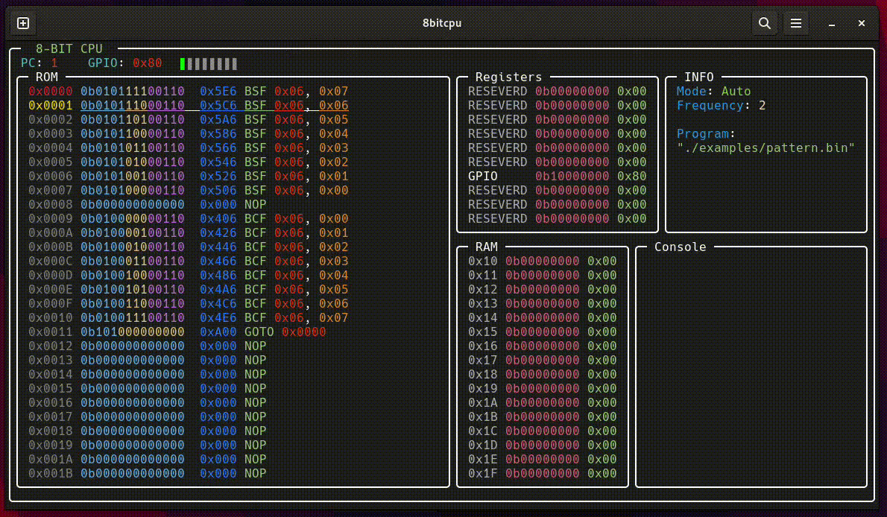

# 8-Bit CPU
This project implements a simplified 8-bit CPU architecture in C, along with an assembler, emulator, and a TUI-based visualization tool. It serves as an educational tool for understanding computer architecture, instruction sets, and low-level programming.

## Preview



## Build
Clone the project by:
```bash
git clone https://github.com/empitrix/8bitcpu
cd ./8bitcpu
```

To build the project using `gnu make` run:
```bash
make
```
After that you will have `./cpu`.

> [!NOTE]
> currently this project is for unix-like operating systems only.


## Usage
For example to use the project run:
```bash
./cpu -p ./examples/pattern.bin
```

Which executes the file [`pattern.asm`](https://github.com/Empitrix/assembler/blob/master/examples/pattern.asm) that generated by [**Assembler**](https://github.com/Empitrix/assembler).

Or if you wish to see the instructions step by step use `-s` flag:
```bash
./cpu -p ./examples/pattern.bin -s
```
In stepping mode if you press `q` the program will end.

And to see how console works use `-c` flag and `hello.bin` program in `examples/` which is running [`hello.asm`](https://github.com/Empitrix/assembler/blob/master/examples/hello.asm):
```bash
./cpu -p ./examples/hello.bin -c
```


## CPU Specifications:
### Memory
- 16 bytes of RAM (Addresses `0x10` to `0x1F`)
- 256 words of ROM (Addresses `0x00` to `0xFF`)

### Registers
- 10 special-purpose registers (Addresses `0x00` to `0x09`)
  - Register `0x06`: GPIO (General Purpose Input/Output)

### Opcodes
<!-- BSF -->
<details>
  <summary>BSF f, b</summary>
  <table>
    <tr>
      <td><strong>Description</strong></td>
      <td>Set bit (<code>b</code>) at address (<code>f</code>) to 1</td>
    </tr>
    <tr>
      <td><strong>Encoding</strong></td>
      <td><code>0101 bbbf ffff</code></td>
    </tr>
    <tr>
      <td><strong>Example</strong></td>
      <td><code>BSF GPIO, 0</code></td>
    </tr>
  </table>
</details>

<!-- BCF -->
<details>
  <summary>BCF f, b</summary>
  <table>
    <tr>
      <td><strong>Description</strong></td>
      <td>Set bit (<code>b</code>) at address (<code>f</code>) to 0</td>
    </tr>
    <tr>
      <td><strong>Encoding</strong></td>
      <td><code>0100 bbbf ffff</code></td>
    </tr>
    <tr>
      <td><strong>Example</strong></td>
      <td><code>BCF GPIO, 0</code></td>
    </tr>
  </table>
</details>

<!-- GOTO -->
<details>
  <summary>GOTO k</summary>
  <table>
    <tr>
      <td><strong>Description</strong></td>
      <td>Goto given lable</td>
    </tr>
    <tr>
      <td><strong>Encoding</strong></td>
      <td><code>101k kkkk kkkk</code></td>
    </tr>
    <tr>
      <td><strong>Example</strong></td>
      <td><code>GOTO start</code></td>
    </tr>
  </table>
</details>


<!-- NOP -->
<details>
  <summary>NOP</summary>
  <table>
    <tr>
      <td><strong>Description</strong></td>
      <td>No operation</td>
    </tr>
    <tr>
      <td><strong>Encoding</strong></td>
      <td><code>0000 0000 0000</code></td>
    </tr>
    <tr>
      <td><strong>Example</strong></td>
      <td><code>NOP</code></td>
    </tr>
  </table>
</details>

<!-- MOVLW -->
<details>
  <summary>MOVLW K</summary>
  <table>
    <tr>
      <td><strong>Description</strong></td>
      <td>Loads a literal (immediate) value into the <code>W</code> register.</td>
    </tr>
    <tr>
      <td><strong>Encoding</strong></td>
      <td><code>1100 KKKK KKKK</code> (where <code>KKKKKKKK</code> is the 8-bit literal value)</td>
    </tr>
    <tr>
      <td><strong>Example</strong></td>
      <td><code>MOVLW 03H</code></td>
    </tr>
  </table>
</details>

<!-- MOVWF -->
<details>
  <summary>MOVWF f</summary>
  <table>
    <tr>
      <td><strong>Description</strong></td>
      <td>Moves the contents of the <code>W</code> register to a specified register or memory location.</td>
    </tr>
    <tr>
      <td><strong>Encoding</strong></td>
      <td><code>0000 001F FFFF</code> (where <code>FFFFF</code> is the 5-bit address)</td>
    </tr>
    <tr>
      <td><strong>Example</strong></td>
      <td><code>MOVWF 06H</code></td>
    </tr>
  </table>
</details>

<!-- CLRF -->
<details>
  <summary>CLRF f</summary>
  <table>
    <tr>
      <td><strong>Description</strong></td>
      <td>Clears (sets to 0) a specified register or memory location.</td>
    </tr>
    <tr>
      <td><strong>Encoding</strong></td>
      <td><code>0000 011F FFFF</code></td>
    </tr>
    <tr>
      <td><strong>Example</strong></td>
      <td><code>CLRF 06H</code></td>
    </tr>
  </table>
</details>

<!-- CLRW -->
<details>
  <summary>CLRW</summary>
  <table>
    <tr>
      <td><strong>Description</strong></td>
      <td>Clears the <code>W</code> register.</td>
    </tr>
    <tr>
      <td><strong>Encoding</strong></td>
      <td><code>0000 0100 0000</code></td>
    </tr>
    <tr>
      <td><strong>Example</strong></td>
      <td><code>CLRW</code></td>
    </tr>
  </table>
</details>

<!-- SLEEP -->
<details>
  <summary>SLEEP</summary>
  <table>
    <tr>
      <td><strong>Description</strong></td>
      <td>Puts the CPU into a standby mode.</td>
    </tr>
    <tr>
      <td><strong>Encoding</strong></td>
      <td><code>0000 0000 0011</code></td>
    </tr>
    <tr>
      <td><strong>Example</strong></td>
      <td><code>SLEEP</code></td>
    </tr>
  </table>
</details>

<!-- DECF -->
<details>
  <summary>DECF f, d</summary>
  <table>
    <tr>
      <td><strong>Description</strong></td>
      <td>Decrement register <code>f</code> and store the result back in <code>f</code> only if (<code>d</code>) destination is <code>1</code> otherwise store the resutl into register <code>W</code>.</td>
    </tr>
    <tr>
      <td><strong>Encoding</strong></td>
      <td><code>0000 11dF FFFF</code></td>
    </tr>
    <tr>
      <td><strong>Example</strong></td>
      <td><code>DECF 0x01, 1</code></td>
    </tr>
  </table>
</details>

<!-- DECFSZ -->
<details>
  <summary>DECFSZ f, d</summary>
  <table>
    <tr>
      <td><strong>Description</strong></td>
      <td>Decrement the contents of register f. If <code>d</code> is <code>0</code>, place the result in the <code>W</code> register. If <code>d</code> is <code>1</code>, place the result back in register <code>f</code>. If the result is <code>0</code>, skip the next instruction (which is already fetched) and execute a <code>NOP</code> instead.</td>
    </tr>
    <tr>
      <td><strong>Encoding</strong></td>
      <td><code>0010 11dF FFFF</code></td>
    </tr>
    <tr>
      <td><strong>Example</strong></td>
      <td><code>DECFSZ 0x02, 1</code></td>
    </tr>
  </table>
</details>

<!-- INCF -->
<details>
  <summary>INCF f, d</summary>
  <table>
    <tr>
      <td><strong>Description</strong></td>
      <td>Increment the contents of register <code>f</code>. If <code>d</code> is <code>0</code>, store the result in the <code>W</code> register. If <code>d</code> is <code>1</code>, store the result back in register <code>f</code>.</td>
    </tr>
    <tr>
      <td><strong>Encoding</strong></td>
      <td><code>0010 10dF FFFF</code></td>
    </tr>
    <tr>
      <td><strong>Example</strong></td>
      <td><code>INCF 0x03, 1</code></td>
    </tr>
  </table>
</details>

<!-- INCFSZ -->
<details>
  <summary>INCFSZ f, d</summary>
  <table>
    <tr>
      <td><strong>Description</strong></td>
      <td>Increment the contents of register f. If <code>d</code> is <code>0</code>, place the result in the <code>W</code> register. If <code>d</code> is <code>1</code>, place the result back in register <code>f</code>. If the result is <code>0</code>, skip the next instruction and execute a <code>NOP</code> instead.</td>
    </tr>
    <tr>
      <td><strong>Encoding</strong></td>
      <td><code>0011 11dF FFFF</code></td>
    </tr>
    <tr>
      <td><strong>Example</strong></td>
      <td><code>INCFSZ 0x04, 1</code></td>
    </tr>
  </table>
</details>

<!-- BTFSS -->
<details>
  <summary>BTFSS f, b</summary>
  <table>
    <tr>
      <td><strong>Description</strong></td>
      <td>Test the bit <code>b</code> in register <code>f</code>. If bit b is <code>1</code>, skip the next instruction (which is already fetched) and execute a <code>NOP</code> instead.</td>
    </tr>
    <tr>
      <td><strong>Encoding</strong></td>
      <td><code>0110 bbbF FFFF</code></td>
    </tr>
    <tr>
      <td><strong>Example</strong></td>
      <td><code>BTFSC 0x06, 2</code></td>
    </tr>
  </table>
</details>

<!-- BTFSC -->
<details>
  <summary>BTFSC f, b</summary>
  <table>
    <tr>
      <td><strong>Description</strong></td>
      <td>Test the bit <code>b</code> in register <code>f</code>. If bit b is <code>0</code>, skip the next instruction (which is already fetched) and execute a <code>NOP</code> instead.</td>
    </tr>
    <tr>
      <td><strong>Encoding</strong></td>
      <td><code>0111 bbbF FFFF</code></td>
    </tr>
    <tr>
      <td><strong>Example</strong></td>
      <td><code>BTFSC 0x06, 2</code></td>
    </tr>
  </table>
</details>


<!-- ADDWF -->
<details>
  <summary>ADDWF f, d</summary>
  <table>
    <tr>
      <td><strong>Description</strong></td>
      <td>Add the value in <code>W</code> register to the specified file register. If <code>d</code> is <code>0</code>, place the result in the <code>W</code> register. If <code>d</code> is <code>1</code>, place the result back in register <code>f</code>.</td>
    </tr>
    <tr>
      <td><strong>Encoding</strong></td>
      <td><code>0001 11df ffff</code></td>
    </tr>
    <tr>
      <td><strong>Example</strong></td>
      <td><code>ADDWF 0x06, 1</code></td>
    </tr>
  </table>
</details>

<!-- ANDWF -->
<details>
  <summary>ANDWF f, d</summary>
  <table>
    <tr>
      <td><strong>Description</strong></td>
      <td>AND the value in <code>W</code> register with the specified file register. If <code>d</code> is <code>0</code>, place the result in the <code>W</code> register. If <code>d</code> is <code>1</code>, place the result back in register <code>f</code>.</td>
    </tr>
    <tr>
      <td><strong>Encoding</strong></td>
      <td><code>0001 01df ffff</code></td>
    </tr>
    <tr>
      <td><strong>Example</strong></td>
      <td><code>ANDWF 0x06, 1</code></td>
    </tr>
  </table>
</details>


<!-- COMF -->
<details>
  <summary>COMF f, d</summary>
  <table>
    <tr>
      <td><strong>Description</strong></td>
      <td>Complement the specified file register. If <code>d</code> is <code>0</code>, place the result in the <code>W</code> register. If <code>d</code> is <code>1</code>, place the result back in register <code>f</code>.</td>
    </tr>
    <tr>
      <td><strong>Encoding</strong></td>
      <td><code>0010 01df ffff</code></td>
    </tr>
    <tr>
      <td><strong>Example</strong></td>
      <td><code>COMF 0x06, 1</code></td>
    </tr>
  </table>
</details>

<!-- IORWF -->
<details>
  <summary>IORWF f, d</summary>
  <table>
    <tr>
      <td><strong>Description</strong></td>
      <td>Inclusive OR the value in <cod>W</cod> register with the specified file register. If <code>d</code> is <code>0</code>, place the result in the <code>W</code> register. If <code>d</code> is <code>1</code>, place the result back in register <code>f</code>.</td>
    </tr>
    <tr>
      <td><strong>Encoding</strong></td>
      <td><code>0001 00df ffff</code></td>
    </tr>
    <tr>
      <td><strong>Example</strong></td>
      <td><code>IORWF 0x06, 1</code></td>
    </tr>
  </table>
</details>

<!-- MOVF -->
<details>
  <summary>MOVF f, d</summary>
  <table>
    <tr>
      <td><strong>Description</strong></td>
      <td>Move content of the specified register. If <code>d</code> is <code>0</code>, place the result in the <code>W</code> register. If <code>d</code> is <code>1</code>, place the result back in register <code>f</code>.</td>
    </tr>
    <tr>
      <td><strong>Encoding</strong></td>
      <td><code>0010 00df ffff</code></td>
    </tr>
    <tr>
      <td><strong>Example</strong></td>
      <td><code>MOVF 0x06, 0</code></td>
    </tr>
  </table>
</details>


<!-- RLF -->
<details>
  <summary>RLF f, d</summary>
  <table>
    <tr>
      <td><strong>Description</strong></td>
      <td>Rotate the specified file register left through the Carry flag. If <code>d</code> is <code>0</code>, place the result in the <code>W</code> register. If <code>d</code> is <code>1</code>, place the result back in register <code>f</code>.</td>
    </tr>
    <tr>
      <td><strong>Encoding</strong></td>
      <td><code>0011 01df ffff</code></td>
    </tr>
    <tr>
      <td><strong>Example</strong></td>
      <td><code>RLF 0x06, 0</code></td>
    </tr>
  </table>
</details>

<!-- RRF -->
<details>
  <summary>RRF f, d</summary>
  <table>
    <tr>
      <td><strong>Description</strong></td>
      <td>Rotate the specified file register right through the Carry flag. If <code>d</code> is <code>0</code>, place the result in the <code>W</code> register. If <code>d</code> is <code>1</code>, place the result back in register <code>f</code>.</td>
    </tr>
    <tr>
      <td><strong>Encoding</strong></td>
      <td><code>0011 00df ffff</code></td>
    </tr>
    <tr>
      <td><strong>Example</strong></td>
      <td><code>RRF 0x06, 0</code></td>
    </tr>
  </table>
</details>

<!-- SUBWF -->
<details>
  <summary>SUBWF f, d</summary>
  <table>
    <tr>
      <td><strong>Description</strong></td>
      <td>Subtract the value in <code>W</code> register from the specified file register. If <code>d</code> is <code>0</code>, place the result in the <code>W</code> register. If <code>d</code> is <code>1</code>, place the result back in register <code>f</code>.</td>
    </tr>
    <tr>
      <td><strong>Encoding</strong></td>
      <td><code>0000 10df ffff</code></td>
    </tr>
    <tr>
      <td><strong>Example</strong></td>
      <td><code>SUBWF 0x06, 0</code></td>
    </tr>
  </table>
</details>


<!-- SWAPF -->
<details>
  <summary>SWAPF f, d</summary>
  <table>
    <tr>
      <td><strong>Description</strong></td>
      <td>Swap the upper and lower nibbles of the specified file register. If <code>d</code> is <code>0</code>, place the result in the <code>W</code> register. If <code>d</code> is <code>1</code>, place the result back in register <code>f</code>.</td>
    </tr>
    <tr>
      <td><strong>Encoding</strong></td>
      <td><code>0011 10df ffff</code></td>
    </tr>
    <tr>
      <td><strong>Example</strong></td>
      <td><code>SWAPF 0x06, 0</code></td>
    </tr>
  </table>
</details>

<!-- XORWF -->
<details>
  <summary>XORWF f, d</summary>
  <table>
    <tr>
      <td><strong>Description</strong></td>
      <td>Exclusive OR the value in <code>W</code> register with the specified file register. If <code>d</code> is <code>0</code>, place the result in the <code>W</code> register. If <code>d</code> is <code>1</code>, place the result back in register <code>f</code>.</td>
    </tr>
    <tr>
      <td><strong>Encoding</strong></td>
      <td><code>0001 10df ffff</code></td>
    </tr>
    <tr>
      <td><strong>Example</strong></td>
      <td><code>XORWF 0x06, 0</code></td>
    </tr>
  </table>
</details>

<!-- ANDLW -->
<details>
  <summary>ANDLW k</summary>
  <table>
    <tr>
      <td><strong>Description</strong></td>
      <td>AND a literal value with the <code>W</code> register</td>
    </tr>
    <tr>
      <td><strong>Encoding</strong></td>
      <td><code>1110 kkkk kkkk</code></td>
    </tr>
    <tr>
      <td><strong>Example</strong></td>
      <td><code>ANDLW 0b00000110</code></td>
    </tr>
  </table>
</details>

<!-- CALL -->
<details>
  <summary>CALL k</summary>
  <table>
    <tr>
      <td><strong>Description</strong></td>
      <td>Call a subroutine.</td>
    </tr>
    <tr>
      <td><strong>Encoding</strong></td>
      <td><code>1001 kkkk kkkk</code></td>
    </tr>
    <tr>
      <td><strong>Example</strong></td>
      <td><code>CALL start</code></td>
    </tr>
  </table>
</details>

<!-- CLRWDT -->
<details>
  <summary>CLRWDT</summary>
  <table>
    <tr>
      <td><strong>Description</strong></td>
      <td>Clear the Watchdog Timer.</td>
    </tr>
    <tr>
      <td><strong>Encoding</strong></td>
      <td><code>0000 0000 0100</code></td>
    </tr>
    <tr>
      <td><strong>Example</strong></td>
      <td><code>CLRWDT</code></td>
    </tr>
  </table>
</details>

<!-- IORLW -->
<details>
  <summary>IORLW k</summary>
  <table>
    <tr>
      <td><strong>Description</strong></td>
      <td>Inclusive OR a literal value with the <code>W</code> register.</td>
    </tr>
    <tr>
      <td><strong>Encoding</strong></td>
      <td><code>1101 kkkk kkkk</code></td>
    </tr>
    <tr>
      <td><strong>Example</strong></td>
      <td><code>IORLW 05H</code></td>
    </tr>
  </table>
</details>


<!-- OPTION -->
<details>
  <summary>OPTION</summary>
  <table>
    <tr>
      <td><strong>Description</strong></td>
      <td>Load the OPTION register.</td>
    </tr>
    <tr>
      <td><strong>Encoding</strong></td>
      <td><code>0000 0000 0010</code></td>
    </tr>
    <tr>
      <td><strong>Example</strong></td>
      <td><code>OPTION</code></td>
    </tr>
  </table>
</details>

<!-- RETLW -->
<details>
  <summary>RETLW k</summary>
  <table>
    <tr>
      <td><strong>Description</strong></td>
      <td>Return from a subroutine and place a literal value in the W register.</td>
    </tr>
    <tr>
      <td><strong>Encoding</strong></td>
      <td><code>1000 kkkk kkkk</code></td>
    </tr>
    <tr>
      <td><strong>Example</strong></td>
      <td><code>RETLW 07H</code></td>
    </tr>
  </table>
</details>

<!-- TRIS -->
<details>
  <summary>TRIS f</summary>
  <table>
    <tr>
      <td><strong>Description</strong></td>
      <td>Load the TRIS register.</td>
    </tr>
    <tr>
      <td><strong>Encoding</strong></td>
      <td><code>0000 0000 0fff</code> (<code>0000 0000 0110</code> or <code>0000 0000 0111</code>)</td>
    </tr>
    <tr>
      <td><strong>Example</strong></td>
      <td><code>TRIS 07H</code> or <code>TRIS 06H</code></td>
    </tr>
  </table>
</details>

<!-- XORLW -->
<details>
  <summary>XORLW k</summary>
  <table>
    <tr>
      <td><strong>Description</strong></td>
      <td>Exclusive OR a literal value with the <code>W</code> register.</td>
    </tr>
    <tr>
      <td><strong>Encoding</strong></td>
      <td><code>1111 kkkk kkkk</code></td>
    </tr>
    <tr>
      <td><strong>Example</strong></td>
      <td><code>XORLW 12H</code></td>
    </tr>
  </table>
</details>


## Flags
| Flag        | Name           | Description                                                                   |
|-------------|----------------|-------------------------------------------------------------------------------|
| `-s`        | Stepping Mode  | Clock pulse with keyboard keys                                                |
| `-f <num>`  | Frequency      | Clock frequency from 1 to 1000000                                             |
| `-p <path>` | Program        | Path to `.bin` file from [`assembler`](https://github.com/empitrix/assembler) |
| `-l <path>` | Load CPU state | Path to a `.txt` file that contains CPU's state                               |
| `-c`        | Console        | Enables the `console` and allows loggin for register `0x06` (GPIO)            |

- If CPU state is loaded with `-l` don't need to use `-p` to load a program to CPU, but make sure that the program is exists for CPU to load it.

### Console
This section displays ASCII characters directly from the CPU's GPIO port. To print a character, write its 7-bit ASCII code to the port and set the eighth bit (bit 7) to 1. The corresponding ASCII character will appear on the console.

```asm
MOVLW 'A'     ; Load the ASCII code for 'A' into register W
MOVWF GPIO    ; Write the value from register W to the GPIO port
BSF GPIO, 7   ; Set the eighth bit (bit 7) of the GPIO port to 1
```


## Actions
- Press `s` to save the cpu's state to a `cpu_state.txt` file!
- Press `<space>` to move to the next step in `stepping mode`.
- Press `<space>` to pause/unpause CPU in `auto mode`.
- Press `r` to reset the cpu while CPU is in `SLEEP`.

<!--
## TODO
Control Functions:
- [x] Save: Implement the functionality to save the current CPU state to a file.
- [x] Run/Pause: Allow the user to start/stop continuous execution of the CPU.
- [ ] Add more opcodes: Implement additional instructions to enhance the CPU's capabilities (e.g., arithmetic, logic, control flow).
-->
